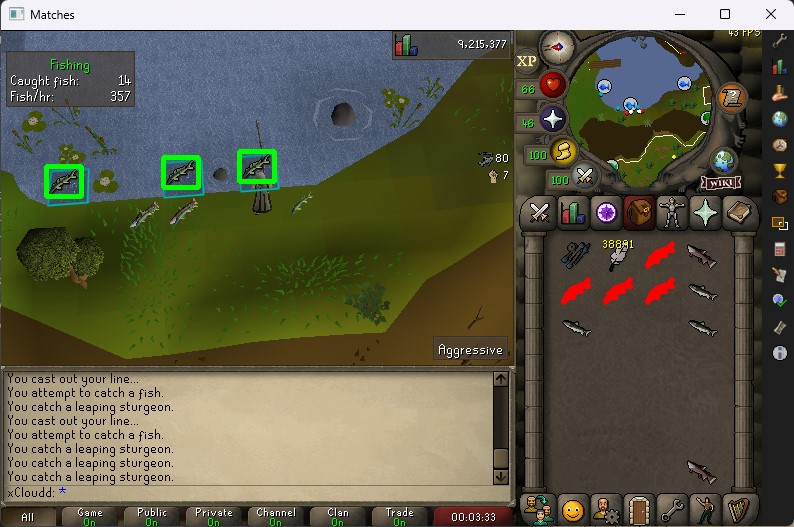
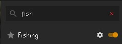

# object_detection_OpenCV
Using OpenCV Library to track ingame objects

-  Projeto iniciado a partir da ideia de detectar e reconhecer objetos em imagens usando a library OpenCV. 

## ⚙️Tecnologias utilizadas e instalação:

- Python 3.10.7: Você pode fazer o download e instalar a partir do [site oficial do python](https://www.python.org/downloads/)

- Pacotes utilizados:
    - [openCV](https://opencv.org)

    - [pyautogui](https://pyautogui.readthedocs.io/en/latest/install.html)

    - [numpy](https://numpy.org/install/)

    - [pywin32](https://pypi.org/project/pywin32/)

- Instalação com o pip:
    ```
    pip install opencv-python
    pip install pyautogui
    pip install numpy
    pip install pywin32
    ```

## 🔬 Exemplo

## 🛠️ Uso

### Setup no Runelite
- É Necessário a utilização do plugin 'Fishing' no client [Runelite](https://runelite.net) de Oldschool Runescape



- Game client layout = "Fixed - Classic Layout" para melhor perfomance

- Posicione a Isca e a Vara de pesca nos dois primeiros slots do inventário, 

### Execução
- Abra o terminal na pasta raiz e execute o comando 
```
python .\main.py
```

- Troque manualmente para a aba do Runelite e Não mova a janela durante a execução (coordenadas são calculadas uma unica vez durante o startup)


